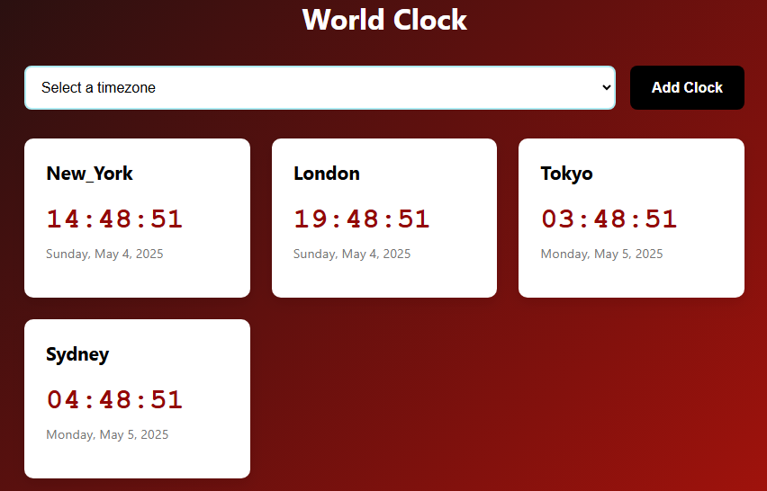

# 🌍 World Clock App

A responsive web application that displays current time in multiple timezones around the world. Built with HTML, CSS, and JavaScript.



## Features

- 🕒 View current time in multiple timezones simultaneously
- ➕ Add new clocks by selecting from predefined timezones
- 🗑️ Remove clocks with one click
- 📱 Fully responsive design (works on mobile, tablet, and desktop)
- 🌙 Automatic dark mode detection
- ✨ Smooth animations and transitions

## Technologies Used

- **Frontend**: HTML5, CSS3, JavaScript (ES6)
- **Styling**: CSS Flexbox and Grid
- **Build**: Pure vanilla JS (no frameworks or libraries)

## Installation

No installation required! The app runs directly in the browser.

1. Clone this repository:
   ```bash
   git clone https://github.com/Philani56/World-Clock-App
   ```

## 🤝 Contributing

Contributions are welcome! If you have suggestions or improvements, feel free to open an issue or submit a pull request.

## 📜 License

This project is licensed under the MIT License - see the LICENSE file for details.

## 📧 Contact

For any inquiries, questions, or feedback, please reach out to:

- Email: khumalophilani580@gmail.com
- LinkedIn: https://www.linkedin.com/in/nhlakanipho-philani-khumalo-679726224/

Feel free to connect with me on social media or via email for more information!
